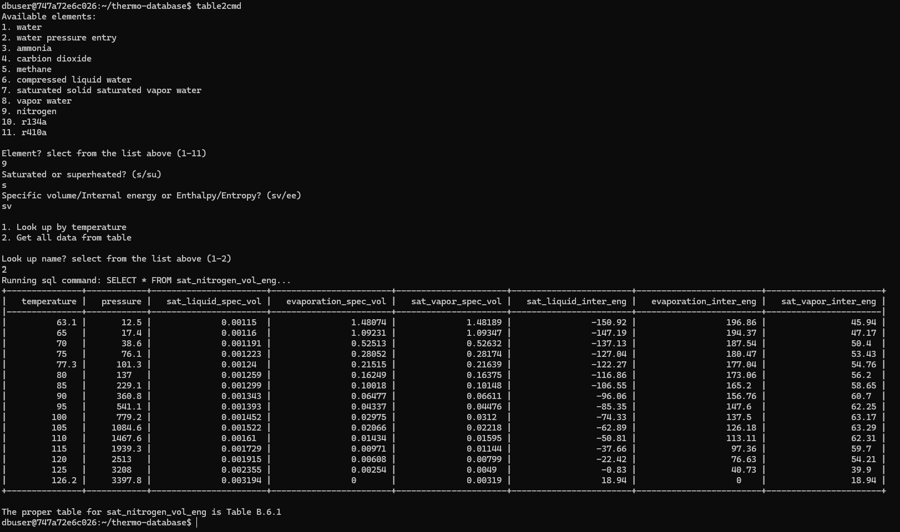
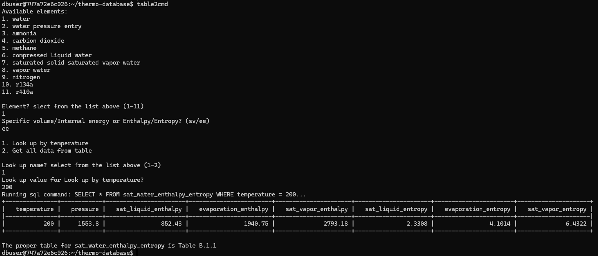
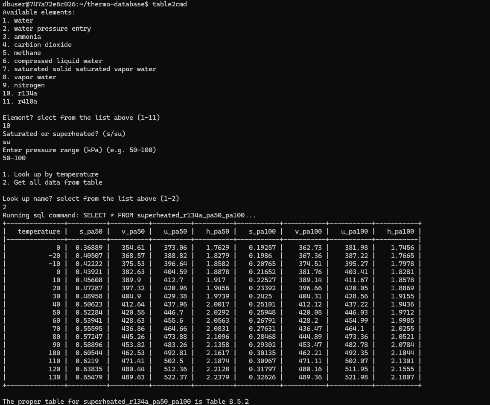

# Thermodynamics Database
This project automates creating and installing a thermodynamics database, which stores common thermodynamic property tables, using MySQL and bash. Additionally, it includes a user-friendly Python script for querying the data, making it easy to retrieve thermodynamic properties with minimal effort.

## Notice
   - This project is meant to run as a containerized application using Docker. It has been tested on both Linux distributions (Ubuntu) and Windows (11) machines. I have not tested it on MacOS, but I have provided instructions for downloading Docker Desktop for MacOS.  
   - If you are on a different Linux distribution other than Ubuntu, you may need to change the installation commands of docker to match your distribution.  
   - This project is a work in progress (as is everything in life), and I am open to suggestions for improvement. Please let me know if you have any ideas or feedback.

## Devices Supported
   - Linux distribution (Ubuntu preferred)
   - Windows 10 or later
   - MacOS

## Dependencies
   - Docker
   - MySQL
   - Python 3
   - Python libraries: mysql-connector, pandas, mysqlclient

## Install Docker if not already installed

### Ubuntu
   ```bash
      sudo apt-get update
      sudo apt-get install docker -y
   ```
   Check the command line for successful installation:
   
   ```bash
      docker --version
   ```

### Windows
   1. Download Docker Desktop for Windows from the official website: [Docker Desktop for Windows](https://desktop.docker.com/win/main/amd64/Docker%20Desktop%20Installer.exe?utm_source=docker&utm_medium=webreferral&utm_campaign=dd-smartbutton&utm_location=module)
   2. Follow the installation instructions provided on the website.
   3. Once installed, open Docker Desktop and ensure it is running.
   4. Enable WSL 2 integration in Docker Desktop settings.
   5. Restart Docker Desktop.
   6. Check the command line (cmd) for successful installation:
      ```bash
         docker --version
      ```

### MacOS
   1. Download Docker Desktop for Mac from the official website:  
         [Docker Desktop for Mac (Intel)](https://desktop.docker.com/mac/main/amd64/Docker.dmg?utm_source=docker&utm_medium=webreferral&utm_campaign=dd-smartbutton&utm_location=module)  
         [Docker Desktop for Mac (Apple Silicon)](https://desktop.docker.com/mac/main/arm64/Docker.dmg?utm_source=docker&utm_medium=webreferral&utm_campaign=dd-smartbutton&utm_location=module)
   2. Follow the installation instructions provided on the website.
   3. Once installed, open Docker Desktop and ensure it is running.
   4. Check the command line (zsh) for successful installation:
      ```zsh
         docker --version
      ```

   No matter what OS you are using, ```docker --version``` should return something like this

   ```bash
      Docker version 27.5.1, build 9f9e405
   ```

## How to use

   1. Clone the repository:

      ```bash
         git clone https://github.com/JoelBeau/thermo-database.git
         cd thermo-database
      ```

   2. Create a docker image

      ```bash
         docker build -t thermo-database .
      ```
      Note: ```-t thermo-database``` is optional, tags the image with a recognizable name. You can also rename the image to anything you want.

   3. Run docker container interactively

      ```bash
         docker run -it --name thermo-database thermo-database
      ```
      Note: you may change the name to anything you want, or not use it at all (docker will assign a random name), 
      but it is useful for stopping and starting the container.

   4. Start MySQL server
      
      This will give a warning, but with my testing, there are no issues.

      ```bash
         sudo service mysql start
      ```
      Note: You will have to start the server every time you start the container.

      If anyone knows how to fix the warning or a better way to do it, please let me know.

   5. Run the Python script for querying the database

      ```bash
         table2cmd
      ```
      If you have suggestions for improving the script, please let me know.

   6. Stop the docker container

      ```bash
         exit
      ```

   7. To start the container and use it again

      ```bash
         docker start thermo-database
         docker attach thermo-database
      ```

## Example of queries ran by the python script

   1. Example of the python script running getting all data from a specific table
      

   2. Example of the python script running getting data from a specific table with a specific tempature
      

   3. Example of the python script running getting data from a specific table with a specific tempature and pressure range  
      
